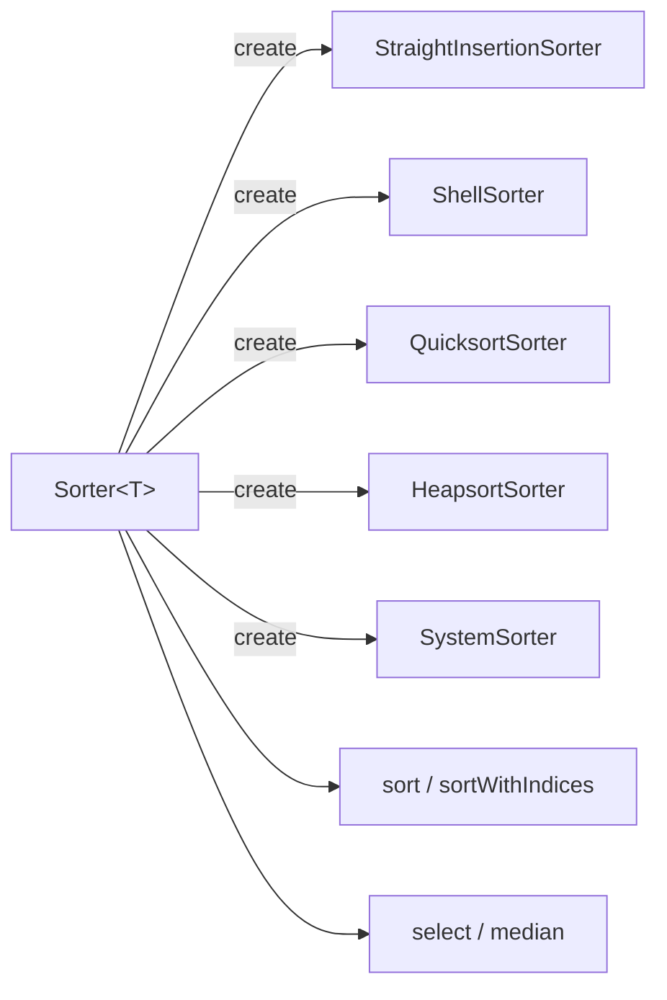

# irurueta-sorting README

🔢 **Irurueta Sorting** is a lightweight Java library that sorts and selects elements in arrays using several classic algorithms.

It provides a common `Sorter` abstraction for sorting arrays of `double`, `float`, `int`, `long` and object types (via `Comparable` or `Comparator`), retrieving the original positions of sorted elements, and finding the k-th smallest element or the median without fully sorting the array.

[](https://github.com/albertoirurueta/irurueta-sorting/actions)
[](https://github.com/albertoirurueta/irurueta-sorting/actions)

[](https://sonarcloud.io/dashboard?id=albertoirurueta_irurueta-sorting)
[](https://sonarcloud.io/dashboard?id=albertoirurueta_irurueta-sorting)
[](https://sonarcloud.io/dashboard?id=albertoirurueta_irurueta-sorting)

[](https://sonarcloud.io/dashboard?id=albertoirurueta_irurueta-sorting)
[](https://sonarcloud.io/dashboard?id=albertoirurueta_irurueta-sorting)

[](https://sonarcloud.io/dashboard?id=albertoirurueta_irurueta-sorting)
[](https://sonarcloud.io/dashboard?id=albertoirurueta_irurueta-sorting)
[](https://sonarcloud.io/dashboard?id=albertoirurueta_irurueta-sorting)

[](https://sonarcloud.io/dashboard?id=albertoirurueta_irurueta-sorting)
[](https://sonarcloud.io/dashboard?id=albertoirurueta_irurueta-sorting)
[](https://sonarcloud.io/dashboard?id=albertoirurueta_irurueta-sorting)

## ✨ Features

- `Sorter<T>` abstract base class with a `Sorter.create(...)` factory to pick an algorithm statically or dynamically.
- Sorts arrays of `double`, `float`, `int`, `long`, and objects (via `Comparable` or a `Comparator`).
- `sortWithIndices` returns the original position of each sorted element, so other arrays/collections can be reordered consistently.
- `select` finds the k-th smallest element, and `median` finds the median, without fully sorting the array.
- Four selectable algorithms: straight insertion, Shell sort, Quicksort, and Heapsort, plus a `SYSTEM_SORTING_METHOD` backed by the JDK's own sort.
- Implementation based on the algorithms in _Numerical Recipes, 3rd Edition_.
- No runtime third-party dependencies.



## 🚦 Project status

- Current release version: `1.4.0`
- Java target: Java 17
- Build system: Maven
- License: Apache License 2.0
- Quality checks: GitHub Actions, JaCoCo, Surefire, and SonarCloud

## 📚 Documentation

- [Project documentation](https://albertoirurueta.github.io/irurueta-sorting/)
- [Javadoc report](https://albertoirurueta.github.io/irurueta-sorting/mvn-site/apidocs/index.html)
- [JaCoCo coverage report](https://albertoirurueta.github.io/irurueta-sorting/mvn-site/jacoco/index.html)
- [Surefire test report](https://albertoirurueta.github.io/irurueta-sorting/mvn-site/surefire.html)
- [SonarCloud dashboard](https://sonarcloud.io/dashboard?id=albertoirurueta_irurueta-sorting)

The Antora documentation source lives in [`docs/modules/ROOT`](docs/modules/ROOT).

## 📦 Installation

### Maven

For a released dependency, pin the version you want to use. Example:

```xml
<dependency>
    <groupId>com.irurueta</groupId>
    <artifactId>irurueta-sorting</artifactId>
    <version>1.4.0</version>
    <scope>compile</scope>
</dependency>
```

For local development against the current repository snapshot:

```xml
<dependency>
    <groupId>com.irurueta</groupId>
    <artifactId>irurueta-sorting</artifactId>
    <version>1.5.0-SNAPSHOT</version>
    <scope>compile</scope>
</dependency>
```

### Gradle

```kotlin
dependencies {
    implementation("com.irurueta:irurueta-sorting:1.4.0")
}
```

## 🚀 Quick examples

### Create a sorter

```java
import com.irurueta.sorting.Sorter;
import com.irurueta.sorting.SortingMethod;

// uses Sorter.DEFAULT_SORTING_METHOD (SYSTEM_SORTING_METHOD)
Sorter<Double> defaultSorter = Sorter.create();

// picks a specific algorithm
Sorter<Double> quicksortSorter = Sorter.create(SortingMethod.QUICKSORT_SORTING_METHOD);
```

### Sort an array

```java
Sorter<Double> sorter = Sorter.create();

double[] values = {5.0, 3.0, 8.0, 1.0, 9.0};
sorter.sort(values);
// values is now {1.0, 3.0, 5.0, 8.0, 9.0}
```

### Sort while tracking original positions

```java
Sorter<Double> sorter = Sorter.create();

double[] values = {5.0, 3.0, 8.0, 1.0};
String[] labels = {"five", "three", "eight", "one"};

int[] indices = sorter.sortWithIndices(values);
// values is now {1.0, 3.0, 5.0, 8.0}
// indices is now {3, 1, 0, 2}

String[] sortedLabels = new String[labels.length];
for (int i = 0; i < indices.length; i++) {
    sortedLabels[i] = labels[indices[i]];
}
// sortedLabels is now {"one", "three", "five", "eight"}
```

### Select the k-th smallest element or the median

```java
Sorter<Double> sorter = Sorter.create();

double[] values = {5.0, 3.0, 8.0, 1.0, 9.0};
double thirdSmallest = sorter.select(2, values);

double[] otherValues = {5.0, 3.0, 8.0, 1.0, 9.0, 2.0};
double median = sorter.median(otherValues);
```

## 🛠️ Build from source

Clone the repository and run Maven:

```bash
git clone https://github.com/albertoirurueta/irurueta-sorting.git
cd irurueta-sorting
mvn test
```

Useful commands:

```bash
mvn test          # run unit tests
mvn package       # build the JAR and generate JaCoCo coverage
mvn site          # generate Maven site reports
```

To build the Antora documentation locally:

```bash
cd docs
npx antora antora-playbook.yml
```

## 🧮 Supported sorting algorithms

| Class | Purpose |
| --- | --- |
| `StraightInsertionSorter` | Simple insertion algorithm; fast enough for small arrays. |
| `ShellSorter` | Diminishing increment method; faster than straight insertion. |
| `QuicksortSorter` | Partition-exchange algorithm; fastest on average for arrays of any size. |
| `HeapsortSorter` | Sorted-tree based algorithm; more consistent worst-case performance. |
| `SystemSorter` | Delegates to the JDK's own sort; sorting only, indices are not available. |

## 🤝 Contributing

Issues and pull requests are welcome.
Before submitting a change, run:

```bash
mvn test
```

For changes affecting documentation, also run:

```bash
cd docs
npx antora antora-playbook.yml
```

## 📄 License

This project is licensed under the [Apache License 2.0](https://www.apache.org/licenses/LICENSE-2.0).
